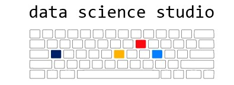

Collection of scenarios to help learn making graphs with ggplot2. 

# Scenarios

1. [Scenario 1][scenario1] - cash, age group, and sex 
2. [Senario 2][scenario2] - suppress for release (repo)
3. [Senario 3][scenario3] - Reproducible graphs with a (`prep` + `plot` + `print`) triad
    - [data description][data_scenario_3]
    - [2019-06-05-session promo][2019_06_05_session_overview]
    - [2019-06-05-session handout][2019_06_05_session_handout]
    - [2019-06-19-session handout][2019_06_19_session_handout]

[data_scenario_3]:data-public/raw/scenario-3/README.md
[2019_06_05_session_overview]:https://raw.githack.com/dss-ialh/graph-making-scenarios/master/libs/materials/promo/dss-2019-06-05-reproducible-graphs-session-3-promo.pdf
[2019_06_05_session_handout]:libs/materials/dss-2019-06-05-session-handout.pdf
[2019_06_19_session_overview]:https://raw.githack.com/dss-ialh/graph-making-scenarios/master/libs/materials/promo/dss-2019-06-19-promo.pdf
[2019_06_19_session_handout]:libs/materials/dss-2019-06-19-session-handout.pdf

[scenario1]:https://raw.githack.com/dss-ialh/graph-making-scenarios/master/analysis/scenario-1/scenario-1.html
[scenario2]:https://github.com/ihacru/suppress-for-release
[scenario3]:https://raw.githack.com/dss-ialh/graph-making-scenarios/master/analysis/scenario-3/scenario-3-ccdss.html

# Live coding session

Live coding sessions are telecast live via [BlueJeans App][bluejeans], with phone dial-in available for audio-only 1-416-900-2956 (Canada)  Meeting ID: 176927559#

[notes_talks]:https://docs.google.com/document/d/1ARRecAQWkWZ80dedC5Qcv7_fHOAny_sE1fHipssauJU/edit?usp=sharing
[bluejeans]:https://bluejeans.com/176927559?src=textEmail
