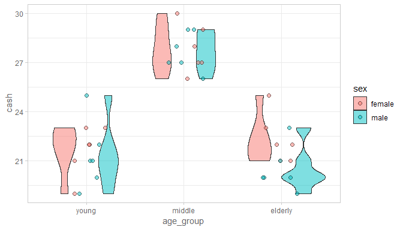

This report creates basic bar graphs and box plots.
<!--  Set the working directory to the repository's base directory; this assumes the report is nested inside of two directories.-->


<!-- Set the report-wide options, and point to the external code file. -->


<!-- Load 'sourced' R files.  Suppress the output when loading sources. --> 

```r
#Load any source files that contain/define functions, but that don't load any other types of variables
#   into memory.  Avoid side effects and don't pollute the global environment.
# source("./SomethingSomething.R")
base::source("./scripts/graphing/graph-presets.R")
```

<!-- Load packages, or at least verify they're available on the local machine.  Suppress the output when loading packages. --> 

```r
library(magrittr) #Pipes
library(ggplot2) #For graphing
library(dplyr)
# requireNamespace("dplyr")
# requireNamespace("tidyr") #For converting wide to long
# requireNamespace("RColorBrewer")
# requireNamespace("scales") #For formating values in graphs
# requireNamespace("mgcv) #For the Generalized Additive Model that smooths the longitudinal graphs.
# requireNamespace("TabularManifest") # devtools::install_github("Melinae/TabularManifest")
```

<!-- Load any global functions and variables declared in the R file.  Suppress the output. --> 

```r
options(show.signif.stars=F) #Turn off the annotations on p-values

path_input <- "./data-public/raw/scenario-1/cash.txt"
```


<!-- Declare any global functions specific to a Rmd output.  Suppress the output. --> 

```r
# Put presentation-specific code in here.  It doesn't call a chunk in the codebehind file.
#   It should be rare (and used cautiously), but sometimes it makes sense to include code in Rmd 
#   that doesn't live in the codebehind R file.
```

<!-- Load the datasets.   -->

```r
# ds <- structure(list(X1 = c(21, 23, 19, 22, 22, 23, 21, 22, 20, 21, 
#                       19, 25, 30, 29, 26, 28, 27, 27, 26, 29, 27, 28, 27, 29, 25, 22, 
#                       23, 21, 22, 21, 23, 19, 20, 21, 20, 20),
#                X2 = c(1L, 1L, 1L, 1L, 1L, 1L, 1L, 1L, 1L, 1L, 1L, 1L, 2L, 2L, 2L, 2L, 2L, 2L, 2L, 2L, 
#                       2L, 2L, 2L, 2L, 3L, 3L, 3L, 3L, 3L, 3L, 3L, 3L, 3L, 3L, 3L, 3L),
#                X3 = c(1L, 1L, 1L, 1L, 1L, 1L, 2L, 2L, 2L, 2L, 2L, 2L, 1L,
#                       1L, 1L, 1L, 1L, 1L, 2L, 2L, 2L, 2L, 2L, 2L, 1L, 1L, 1L, 1L, 1L, 
#                       1L, 2L, 2L, 2L, 2L, 2L, 2L), 
#                X4 = c(1L, 2L, 3L, 4L, 5L, 6L, 1L, 2L, 3L, 4L, 5L, 6L, 1L, 2L, 3L, 4L, 5L, 6L, 1L, 2L, 3L, 4L, 5L, 
#                       6L, 1L, 2L, 3L, 4L, 5L, 6L, 1L, 2L, 3L, 4L, 5L, 6L)), 
#           .Names = c("X1", "X2", "X3", "X4"), 
#           row.names = c(NA, -36L), 
#           class = c("tbl_df", "tbl", "data.frame"), 
#           spec = structure(
#             list(cols = structure(list(X1 = structure(list(), class = c("collector_double", "collector")
#                     ),X2 = structure(list(), class = c("collector_integer", "collector")), 
#                     X3 = structure(list(), class = c("collector_integer", "collector")), 
#                     X4 = structure(list(), class = c("collector_integer", "collector"))), 
#                     .Names = c("X1", "X2", "X3", "X4")), 
#                  default = structure(list(), class = c("collector_guess", "collector"))),
#             .Names = c("cols", "default"), class = "col_spec"))

# alternatively, read from stored file
ds <- readr::read_table2(path_input, col_names = FALSE) # 'ds' stands for 'datasets'
```

<!-- Tweak the datasets.   -->

```r
names(ds) <- c("cash", "age_group", "sex", "group")
ds %>% glimpse()
```

```
Observations: 36
Variables: 4
$ cash      <dbl> 21, 23, 19, 22, 22, 23, 21, 22, 20, 21, 19, 25, 30, 29, 26, 28, 27, 27, 26, 2...
$ age_group <int> 1, 1, 1, 1, 1, 1, 1, 1, 1, 1, 1, 1, 2, 2, 2, 2, 2, 2, 2, 2, 2, 2, 2, 2, 3, 3,...
$ sex       <int> 1, 1, 1, 1, 1, 1, 2, 2, 2, 2, 2, 2, 1, 1, 1, 1, 1, 1, 2, 2, 2, 2, 2, 2, 1, 1,...
$ group     <int> 1, 2, 3, 4, 5, 6, 1, 2, 3, 4, 5, 6, 1, 2, 3, 4, 5, 6, 1, 2, 3, 4, 5, 6, 1, 2,...
```

```r
ds %>% head()
```

```
# A tibble: 6 x 4
   cash age_group   sex group
  <dbl>     <int> <int> <int>
1   21.         1     1     1
2   23.         1     1     2
3   19.         1     1     3
4   22.         1     1     4
5   22.         1     1     5
6   23.         1     1     6
```

```r
ds %>% group_by(age_group) %>% summarize(n = n())
```

```
# A tibble: 3 x 2
  age_group     n
      <int> <int>
1         1    12
2         2    12
3         3    12
```

```r
# create factor levels
ds <- ds %>% 
  dplyr::mutate(
    age_group = factor(age_group, levels = c(1,2,3), labels = c("young","middle","elderly"))
    ,sex       = factor(sex, levels = c(1,2),   labels = c("female", "male"))
    ,female    = ifelse(sex == 1, TRUE, FALSE)
  ) %>% 
  dplyr::select(female, sex, age_group, cash)
```

Summary {.tabset .tabset-fade .tabset-pills}
===========================================================================

Notes 
---------------------------------------------------------------------------


Graphs
===========================================================================


Bar graphs
---------------------------------------------------------------------------


```r
g1 <- ds %>% 
  ggplot2::ggplot(aes(x=age_group, y = cash))+
  geom_bar(stat = "identity",aes(fill=sex), position = position_dodge())+
  main_theme
g1
```

<!-- -->

Box plots
---------------------------------------------------------------------------


```r
g2 <- ds %>% 
  ggplot2::ggplot(aes(x=age_group, y = cash, fill= sex))+
  geom_boxplot(alpha = .5, show.legend = T)+
  geom_jitter(height = 0, width = .2, shape = 21, size = 2, alpha = .5)+
  main_theme
g2
```

<!-- -->

```r
g2a <- ds %>% 
  ggplot2::ggplot(aes(x=age_group, y = cash, fill= sex))+
  geom_violin(alpha = .5, show.legend = T)+
  geom_jitter(height = 0, width = .2, shape = 21, size = 2, alpha = .5)+
  main_theme
g2a
```

<!-- -->

How to print graphs
---------------------------------------------------------------------------


```r
# create a function that prints an alluvia plot with the label on top as a separate plot
print_plot_basic <- function(  
  g
  ,path_output_folder 
  ,graph_name 
  ,suffix = NA
  ,...
){
  # if folder does not exist yet, create it
  if(!dir.exists(path_output_folder)){
    dir.create(path_output_folder)
  }
  # browser()
  graph_name <- paste0(graph_name) # for automatic adjustment if needed
  
  # add a label to distinguish a particular graph (last element in the file name)
  if(!is.na(suffix)){
    (path_save_plot <- paste0(path_output_folder,graph_name,"-",suffix)) 
  }else{
    (path_save_plot <- paste0(path_output_folder,graph_name)) 
  }
  # implemet plot corrects for the complex display
  
  # jpeg device open
  jpeg(
    filename = paste0(path_save_plot, ".jpg")
    ,...
  )
  # g <- g + ggplot2::theme()
  g %>% print()
  # l_support$plots$alluvia2axes %>% ggpubr::get_legend() %>% ggpubr::as_ggplot() %>% print()
  # l_support$plots$alluvia2axes %>% ggpubr::get_legend() %>% ggpubr::as_ggplot() %>% print()
  dev.off() # close the device
  # jpeg device close
  
}
# how to use
g <- ds %>% 
  ggplot2::ggplot(aes(x=age_group, y = cash, fill= sex))+
  geom_boxplot(alpha = .5, show.legend = T)+
  geom_jitter(height = 0, width = .2, shape = 21, size = 2, alpha = .5)+
  main_theme 
g %>% 
  print_plot_basic(
    "./analysis/scenario-1/prints/"
    ,"example-1"
    ,width         = 216
    ,height        = 140
    ,units         = "mm"
    ,quality       = 100 # percent
    ,res           = 300 # dpi
    )
```

```
RStudioGD 
        2 
```

```r
# show created file
list.files("./analysis/scenario-1/prints/", full.names = TRUE)
```

<!-- -->

```
[1] "./analysis/scenario-1/prints/example-1.jpg" "./analysis/scenario-1/prints/README.md"    
```

```r
# Size           Width x Height (mm) Width x Height (in)  Aspect Ratio
# Half Letter      140 x 216           5.5 x  8.5          1: 1.55
# Letter           216 x 279           8.5 x 11.0          1: 1.29
# Legal            216 x 356           8.5 x 14.0          1: 1.65
# Junior Legal     127 x 203           5.0 x  8.0          1: 1.60
# Ledger/Tabloid   279 x 432          11.0 x 17.0          1: 1.55
```


Custom graphs
===========================================================================
Frequently we need to specify custom functions for graphing, indigenous to the current report


```r
# 
# The two graphing functions are copied from https://github.com/Melinae/TabularManifest.
histogram_discrete <- function(
  d_observed,
  variable_name,
  levels_to_exclude   = character(0),
  main_title          = variable_name,
  x_title             = NULL,
  y_title             = "Number of Included Records",
  text_size_percentage= 6,
  bin_width           = 1L,
  font_base_size      = 12
) {
  
  # Ungroup, in case it comes in grouped.
  d_observed <-
    d_observed %>%
    dplyr::ungroup()
  
  if( !base::is.factor(d_observed[[variable_name]]) )
    d_observed[[variable_name]] <- base::factor(d_observed[[variable_name]])
  
  d_observed$iv <- base::ordered(d_observed[[variable_name]], levels=rev(levels(d_observed[[variable_name]])))
  
  d_count <- dplyr::count_(d_observed, vars ="iv" )
  # if( base::length(levels_to_exclude)>0 ) { }
  d_count <- d_count[!(d_count$iv %in% levels_to_exclude), ]
  
  d_summary <- d_count %>%
    dplyr::rename_(
      "count"    =  "n"
    ) %>%
    dplyr::mutate(
      proportion = count / sum(count)
    )
  d_summary$percentage <- base::paste0(base::round(d_summary$proportion*100), "%")
  
  y_title <- base::paste0(y_title, " (n=", scales::comma(base::sum(d_summary$count)), ")")
  
  g <-
    ggplot(d_summary, aes_string(x="iv", y="count", fill="iv", label="percentage")) +
    geom_bar(stat="identity") +
    geom_text(stat="identity", size=text_size_percentage, hjust=.8, na.rm=T) +
    scale_y_continuous(labels=scales::comma_format()) +
    labs(title=main_title, x=x_title, y=y_title) +
    coord_flip()
  
  theme  <-
    theme_light(base_size=font_base_size) +
    theme(legend.position       =  "none") +
    theme(panel.grid.major.y    =  element_blank()) +
    theme(panel.grid.minor.y    =  element_blank()) +
    theme(axis.text.y           =  element_text(size=font_base_size + 2L)) +
    theme(axis.text.x           =  element_text(colour="gray40")) +
    theme(axis.title.x          =  element_text(colour="gray40")) +
    theme(panel.border          =  element_rect(colour="gray80")) +
    theme(axis.ticks            =  element_blank())
  
  return( g + theme )
}
histogram_continuous <- function(
  d_observed,
  variable_name,
  bin_width               = NULL,
  main_title              = base::gsub("_", " ", variable_name, perl=TRUE),
  x_title                 = paste0(variable_name, "\n(each bin is ", scales::comma(bin_width), " units wide)"),
  y_title                 = "Frequency",
  rounded_digits          = 0L,
  font_base_size          = 12
) {
  
  if( !inherits(d_observed, "data.frame") )
    stop("`d_observed` should inherit from the data.frame class.")
  
  d_observed <- d_observed[!base::is.na(d_observed[[variable_name]]), ]
  
  ds_mid_points <- base::data.frame(label=c("italic(X)[50]", "bar(italic(X))"), stringsAsFactors=FALSE)
  ds_mid_points$value <- c(stats::median(d_observed[[variable_name]]), base::mean(d_observed[[variable_name]]))
  ds_mid_points$value_rounded <- base::round(ds_mid_points$value, rounded_digits)
  
  if( ds_mid_points$value[1] < ds_mid_points$value[2] ) {
    h_just <- c(1, 0)
  } else {
    h_just <- c(0, 1)
  }
  
  g <- ggplot2::ggplot(d_observed, ggplot2::aes_string(x=variable_name))
  g <- g + ggplot2::geom_histogram(binwidth=bin_width, position=ggplot2::position_identity(), fill="gray70", color="gray90", alpha=.7)
  g <- g + ggplot2::geom_vline(xintercept=ds_mid_points$value, color="gray30")
  g <- g + ggplot2::geom_text(data=ds_mid_points, ggplot2::aes_string(x="value", y=0, label="value_rounded"), color="tomato", hjust=h_just, vjust=.5, na.rm=T)
  g <- g + ggplot2::scale_x_continuous(labels=scales::comma_format())
  g <- g + ggplot2::scale_y_continuous(labels=scales::comma_format())
  g <- g + ggplot2::labs(title=main_title, x=x_title, y=y_title)
  
  g <-
    g + ggplot2::theme_light(base_size = font_base_size) +
    ggplot2::theme(axis.ticks             = ggplot2::element_blank())
  
  ds_mid_points$top <- stats::quantile(ggplot2::ggplot_build(g)$layout$panel_ranges[[1]]$y.range, .8)
  g <- g + ggplot2::geom_text(data=ds_mid_points, ggplot2::aes_string(x="value", y="top", label="label"), color="tomato", hjust=h_just, parse=TRUE, na.rm=T)
  return( g )
}
```

Marginals
---------------------------------------------------------------------------


```r
# custom function we have defined ourselves
ds %>% histogram_continuous("cash", bin_width = 1)
```

<!-- -->

```r
# the version we stole the design from:
ds %>% TabularManifest::histogram_continuous("cash",bin_width = 1)
```

<!-- -->

```r
# custom function we have defined ourselves
ds %>% histogram_discrete("sex")
```

<!-- -->

```r
# the version we stole the design from:
ds %>% TabularManifest::histogram_discrete("age_group")
```

<!-- -->


Models
===========================================================================

Model Exploration
---------------------------------------------------------------------------


Final Model
---------------------------------------------------------------------------


Session Information
===========================================================================

For the sake of documentation and reproducibility, the current report was rendered in the following environment.  Click the line below to expand.

<details>
  <summary>Environment <span class="glyphicon glyphicon-plus-sign"></span></summary>

```
Session info --------------------------------------------------------------------------------------
```

```
 setting  value                       
 version  R version 3.4.4 (2018-03-15)
 system   x86_64, mingw32             
 ui       RStudio (1.1.442)           
 language (EN)                        
 collate  English_United States.1252  
 tz       America/Los_Angeles         
 date     2018-10-15                  
```

```
Packages ------------------------------------------------------------------------------------------
```

```
 package         * version     date       source                                  
 assertthat        0.2.0       2017-04-11 CRAN (R 3.4.1)                          
 backports         1.1.2       2017-12-13 CRAN (R 3.4.3)                          
 base            * 3.4.4       2018-03-15 local                                   
 bindr             0.1.1       2018-03-13 CRAN (R 3.4.4)                          
 bindrcpp        * 0.2.2       2018-03-29 CRAN (R 3.4.4)                          
 cli               1.0.0       2017-11-05 CRAN (R 3.4.3)                          
 colorspace        1.3-2       2016-12-14 CRAN (R 3.4.1)                          
 compiler          3.4.4       2018-03-15 local                                   
 cowplot           0.9.3       2018-07-15 CRAN (R 3.4.4)                          
 crayon            1.3.4       2017-09-16 CRAN (R 3.4.2)                          
 datasets        * 3.4.4       2018-03-15 local                                   
 devtools          1.13.6      2018-06-27 CRAN (R 3.4.4)                          
 dichromat       * 2.0-0       2013-01-24 CRAN (R 3.4.1)                          
 digest            0.6.18      2018-10-10 CRAN (R 3.4.4)                          
 dplyr           * 0.7.6       2018-06-29 CRAN (R 3.4.4)                          
 evaluate          0.10.1      2017-06-24 CRAN (R 3.4.1)                          
 extrafont       * 0.17        2014-12-08 CRAN (R 3.4.3)                          
 extrafontdb       1.0         2012-06-11 CRAN (R 3.4.1)                          
 GGally            1.4.0       2018-05-17 CRAN (R 3.4.4)                          
 ggplot2         * 3.0.0       2018-07-03 CRAN (R 3.4.4)                          
 glue              1.3.0       2018-07-17 CRAN (R 3.4.4)                          
 graphics        * 3.4.4       2018-03-15 local                                   
 grDevices       * 3.4.4       2018-03-15 local                                   
 grid            * 3.4.4       2018-03-15 local                                   
 gtable            0.2.0       2016-02-26 CRAN (R 3.4.1)                          
 hms               0.4.1       2018-01-24 CRAN (R 3.4.3)                          
 htmltools         0.3.6       2017-04-28 CRAN (R 3.4.2)                          
 htmlwidgets       1.0         2018-01-20 CRAN (R 3.4.3)                          
 knitr           * 1.20        2018-02-20 CRAN (R 3.4.3)                          
 labeling          0.3         2014-08-23 CRAN (R 3.4.1)                          
 lazyeval          0.2.1       2017-10-29 CRAN (R 3.4.4)                          
 magrittr        * 1.5         2014-11-22 CRAN (R 3.4.1)                          
 markdown          0.8         2017-04-20 CRAN (R 3.4.1)                          
 memoise           1.1.0       2017-04-21 CRAN (R 3.4.1)                          
 methods         * 3.4.4       2018-03-15 local                                   
 munsell           0.5.0       2018-06-12 CRAN (R 3.4.4)                          
 pillar            1.2.1       2018-02-27 CRAN (R 3.4.1)                          
 pkgconfig         2.0.1       2017-03-21 CRAN (R 3.4.1)                          
 plyr              1.8.4       2016-06-08 CRAN (R 3.4.1)                          
 purrr             0.2.5       2018-05-29 CRAN (R 3.4.4)                          
 R6                2.2.2       2017-06-17 CRAN (R 3.4.1)                          
 RColorBrewer    * 1.1-2       2014-12-07 CRAN (R 3.4.1)                          
 Rcpp              0.12.18     2018-07-23 CRAN (R 3.4.4)                          
 readr             1.1.1       2017-05-16 CRAN (R 3.4.1)                          
 reshape           0.8.7       2017-08-06 CRAN (R 3.4.4)                          
 rlang             0.2.2       2018-08-16 CRAN (R 3.4.4)                          
 rmarkdown         1.8         2017-11-17 CRAN (R 3.4.3)                          
 rpivotTable       0.3.0       2018-01-30 CRAN (R 3.4.4)                          
 rprojroot         1.3-2       2018-01-03 CRAN (R 3.4.3)                          
 rstudioapi        0.7         2017-09-07 CRAN (R 3.4.1)                          
 Rttf2pt1          1.3.6       2018-02-22 CRAN (R 3.4.3)                          
 scales            1.0.0       2018-08-09 CRAN (R 3.4.4)                          
 stats           * 3.4.4       2018-03-15 local                                   
 stringi           1.1.7       2018-03-12 CRAN (R 3.4.4)                          
 stringr           1.3.1       2018-05-10 CRAN (R 3.4.4)                          
 TabularManifest   0.1-16.9003 2018-09-02 Github (Melinae/TabularManifest@4cbc21c)
 testit            0.8         2018-06-14 CRAN (R 3.4.4)                          
 tibble            1.4.2       2018-01-22 CRAN (R 3.4.3)                          
 tidyselect        0.2.3       2017-11-06 CRAN (R 3.4.3)                          
 tools             3.4.4       2018-03-15 local                                   
 utf8              1.1.3       2018-01-03 CRAN (R 3.4.3)                          
 utils           * 3.4.4       2018-03-15 local                                   
 viridisLite       0.3.0       2018-02-01 CRAN (R 3.4.3)                          
 withr             2.1.1       2017-12-19 CRAN (R 3.4.3)                          
 yaml              2.1.19      2018-05-01 CRAN (R 3.4.4)                          
```
</details>


Report rendered by koval at 2018-10-15, 16:48 -0700 in 5 seconds.
