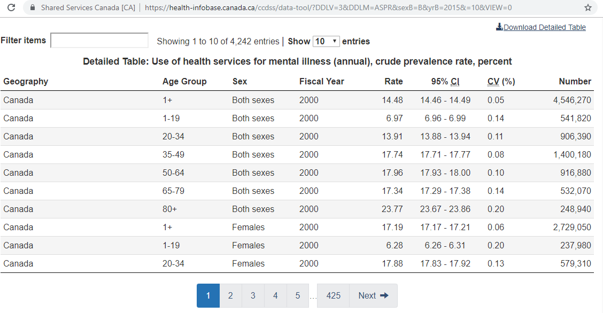

`./data-public/raw/scenario-3` Directory
=========

Data pulled from the Canadian Chronic Disease Surveillance System (CCDSS). View data dictionary at http://infobase.phac-aspc.gc.ca/cubes/ccdss-eng.html. 

# Mental Health Services
- URL: https://health-infobase.canada.ca/ccdss/data-tool/
- Tab: `Trends over time`
- Geography: `Canada`
- Condition : `Use of health services for mental illness (annual)`
- Measure : `Crude prevalence rate` 
- Sex : `Both sexes` + `Males` + `Females`
- Fiscal Year: `2000:2015`
- Local file: [`./data-public/raw/scenario-3/PHAC_Infobase_CCDSS_-8586421810172823624.csv`](PHAC_Infobase_CCDSS_-8586421810172823624.csv)

# Mood & Anxiety

- URL: https://health-infobase.canada.ca/ccdss/data-tool/
- Tab: `Trends over time`
- Geography: `Canada`
- Condition : `Use of health services for mood and anxiety disorders (annual)`
- Measure : `Crude prevalence rate` 
- Sex : `Both sexes` + `Males` + `Females`
- Fiscal Year: `2000:2015`
- Local file: [`./data-public/raw/scenario-3/PHAC_Infobase_CCDSS_-8586421808967913043.csv`](PHAC_Infobase_CCDSS_-8586421808967913043.csv)

